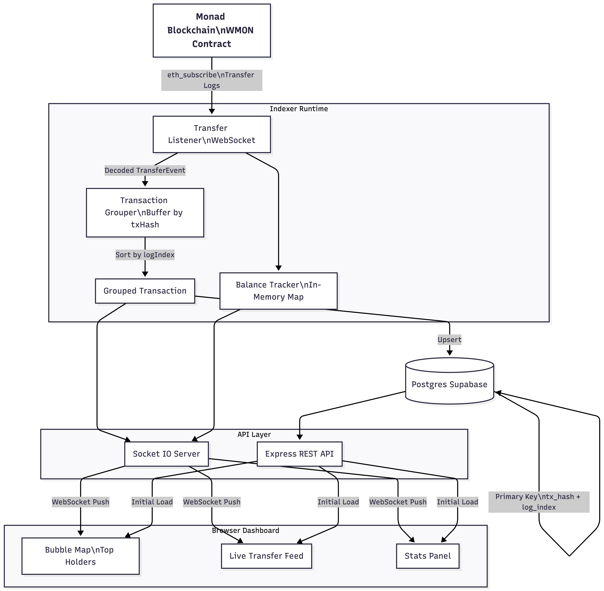

# WMON Token Indexer & Live Dashboard

A real-time blockchain indexer for WMON (Wrapped MON) token transfers on Monad mainnet, with live WebSocket streaming and a bubble map visualization.



---

## 🚀 Live Demo

**[View Live Dashboard →](https://wmon-indexer-production.up.railway.app/)**

---

## 🎯 The Problem I Solved

**Interview Question:** *"How do you handle multiple ERC-20 Transfer events that occur within a single transaction?"*

In blockchain, a single transaction can emit multiple Transfer events. For example:
- A DEX swap might do: `User → Router → Pool → User` (4 transfers)
- A batch payment might send tokens to 10 addresses in one tx
- A flash loan borrows, uses, and repays in one atomic operation

This project demonstrates how to:
1. Group Transfer events by `transactionHash`
2. Order them by `logIndex` (position within the transaction)
3. Detect patterns (swaps, router contracts, chain transfers)
4. Process them idempotently (no duplicates on re-runs)

---

## 📁 Project Structure

```
src/
├── index.ts                    # Entry point - orchestrates everything
├── config/
│   └── index.ts                # Environment config (WSS URL, contracts)
├── types/
│   └── index.ts                # TypeScript interfaces
├── listeners/
│   └── transferListener.ts     # WebSocket subscription to Transfer events
├── trackers/
│   ├── balanceTracker.ts       # In-memory balance state
│   └── transactionGrouper.ts   # Groups events by txHash
├── db/
│   ├── supabase.ts             # Database client
│   └── transferRepository.ts   # CRUD operations for transfers
├── api/
│   ├── server.ts               # Express + Socket.io server
│   └── routes.ts               # REST API endpoints
└── public/
    └── index.html              # Frontend dashboard
```

---

## 🔧 Technical Deep Dive

### 1. Types (`src/types/index.ts`)

```typescript
// Represents a decoded Transfer event
interface TransferEvent {
  from: string;           // Sender address
  to: string;             // Receiver address
  value: bigint;          // Amount in wei (18 decimals)
  blockNumber: number;    // Block where tx was included
  transactionHash: string;// Unique tx identifier
  logIndex: number;       // Position within the transaction (0, 1, 2...)
  timestamp: number;      // Unix timestamp
}

// Multiple transfers grouped by transaction
interface GroupedTransaction {
  transactionHash: string;
  blockNumber: number;
  timestamp: number;
  transfers: TransferEvent[];  // Sorted by logIndex
}
```

**Why `logIndex` matters:**
- Events within a transaction are ordered
- `logIndex: 0` happens before `logIndex: 1`
- This ordering is deterministic and part of the EVM spec

---

### 2. Transfer Listener (`src/listeners/transferListener.ts`)

Subscribes to WMON Transfer events via WebSocket:

```typescript
const filter = {
  address: CONTRACTS.WMON,  // 0x3bd359C1119dA7Da1D913D1C4D2B7c461115433A
  topics: [TRANSFER_EVENT_TOPIC]  // keccak256("Transfer(address,address,uint256)")
};

provider.on(filter, async (log: Log) => {
  const decoded = decodeTransferLog(log);
  // ... process event
});
```

**Decoding the log:**
```typescript
// ERC-20 Transfer: Transfer(address indexed from, address indexed to, uint256 value)
// - topics[0] = event signature hash
// - topics[1] = from address (padded to 32 bytes)
// - topics[2] = to address (padded to 32 bytes)
// - data = value (uint256)

const from = ethers.getAddress('0x' + log.topics[1].slice(26));
const to = ethers.getAddress('0x' + log.topics[2].slice(26));
const value = BigInt(log.data);
const logIndex = log.index;  // Critical for ordering!
```

---

### 3. Transaction Grouper (`src/trackers/transactionGrouper.ts`)

**The core solution to the interview question.**

```typescript
// Buffer events by transaction hash
const pendingTransfers = new Map<string, TransferEvent[]>();

function addTransfer(transfer: TransferEvent): void {
  const existing = pendingTransfers.get(transfer.transactionHash) || [];
  existing.push(transfer);
  pendingTransfers.set(transfer.transactionHash, existing);
}

function flushPendingTransactions(): void {
  for (const [txHash, transfers] of pendingTransfers.entries()) {
    // Sort by logIndex to maintain correct order
    transfers.sort((a, b) => a.logIndex - b.logIndex);
    
    // Emit as a grouped transaction
    emit({ transactionHash: txHash, transfers });
  }
  pendingTransfers.clear();
}
```

**When to flush:**
- On each new block (events from previous block are complete)
- Ensures we don't emit partial transactions

**Pattern detection:**
```typescript
function identifyPattern(transfers): string {
  // Bidirectional = swap
  if (transfers[0].from === transfers[1].to && 
      transfers[0].to === transfers[1].from) {
    return 'Likely a swap';
  }
  
  // Same sender = multi-send
  if (transfers.every(t => t.from === transfers[0].from)) {
    return 'Multi-send from same address';
  }
  
  // One address appears 3+ times = router
  // ... etc
}
```

---

### 4. Balance Tracker (`src/trackers/balanceTracker.ts`)

In-memory balance state:

```typescript
const balances = new Map<string, bigint>();

function updateBalance(from: string, to: string, value: bigint): void {
  // Decrease sender (skip if mint from zero address)
  if (from !== ZERO_ADDRESS) {
    const fromBalance = balances.get(from) ?? 0n;
    balances.set(from, fromBalance - value);
  }
  
  // Increase receiver (skip if burn to zero address)
  if (to !== ZERO_ADDRESS) {
    const toBalance = balances.get(to) ?? 0n;
    balances.set(to, toBalance + value);
  }
}
```

**Note:** This tracks deltas from when the app started, not absolute balances. For absolute balances, you'd need historical backfill.

---

### 5. Database Layer (`src/db/`)

**Supabase client (`supabase.ts`):**
```typescript
import { createClient } from '@supabase/supabase-js';

const supabase = createClient(
  process.env.SUPABASE_URL,
  process.env.SUPABASE_ANON_KEY
);
```

**Transfer repository (`transferRepository.ts`):**
```typescript
async function insertGroupedTransaction(groupedTx: GroupedTransaction) {
  const rows = groupedTx.transfers.map(t => ({
    tx_hash: t.transactionHash,
    log_index: t.logIndex,
    from_address: t.from,
    to_address: t.to,
    value: t.value.toString(),  // BigInt as string
    block_number: t.blockNumber,
    timestamp: t.timestamp,
  }));

  await supabase
    .from('transfers')
    .upsert(rows, { 
      onConflict: 'tx_hash,log_index',  // Unique key
      ignoreDuplicates: true            // Idempotent!
    });
}
```

**Why `(tx_hash, log_index)` is the unique key:**
- A transaction hash is unique globally
- Within a transaction, each log has a unique index
- Together, they uniquely identify any event ever emitted

**Database schema:**
```sql
CREATE TABLE transfers (
  tx_hash TEXT NOT NULL,
  log_index INTEGER NOT NULL,
  from_address TEXT NOT NULL,
  to_address TEXT NOT NULL,
  value TEXT NOT NULL,
  block_number INTEGER NOT NULL,
  timestamp INTEGER NOT NULL,
  PRIMARY KEY (tx_hash, log_index)  -- Composite primary key
);
```

---

### 6. API Server (`src/api/`)

**Express + Socket.io (`server.ts`):**
```typescript
import { Server as SocketServer } from 'socket.io';

const io = new SocketServer(httpServer);

// Emit events to all connected clients
export function emitGroupedTransaction(groupedTx) {
  io.emit('groupedTx', groupedTx);
}

export function emitHolders(holders) {
  io.emit('holders', holders);
}
```

**REST endpoints (`routes.ts`):**

| Endpoint | Description |
|----------|-------------|
| `GET /api/holders?limit=20` | Top holders by balance |
| `GET /api/transfers?limit=20` | Recent transfers from DB |
| `GET /api/stats` | Session and database statistics |
| `GET /api/tx/:hash` | All transfers in a specific transaction |
| `GET /api/holders/:address` | Balance for a specific address |

---

### 7. Frontend (`src/public/index.html`)

**Real-time via Socket.io:**
```javascript
const socket = io();

// No polling! Events pushed instantly
socket.on('groupedTx', (groupedTx) => {
  // Add to UI immediately
  renderTransfer(groupedTx);
});

socket.on('holders', (holders) => {
  // Update bubble sizes
  renderBubbles(holders);
});

socket.on('stats', (stats) => {
  // Flash animation on update
  updateStats(stats);
});
```

**Initial load via REST API:**
```javascript
// One-time fetch on page load
const holders = await fetch('/api/holders').then(r => r.json());
const transfers = await fetch('/api/transfers').then(r => r.json());
```

---

## 📊 Data Flow

```
┌─────────────────────────────────────────────────────────────────┐
│                    MONAD BLOCKCHAIN                             │
│                                                                 │
│   Block N: [TX1, TX2, TX3...]                                   │
│            TX1 emits: Transfer(A→B), Transfer(B→C)              │
└─────────────────────────┬───────────────────────────────────────┘
                          │ WebSocket (eth_subscribe)
                          ▼
┌─────────────────────────────────────────────────────────────────┐
│                  TRANSFER LISTENER                              │
│                                                                 │
│   Receives: Log { topics, data, transactionHash, index }        │
│   Decodes:  TransferEvent { from, to, value, logIndex }         │
└─────────────────────────┬───────────────────────────────────────┘
                          │
          ┌───────────────┼───────────────┐
          ▼               ▼               ▼
┌─────────────────┐ ┌─────────────┐ ┌─────────────────┐
│ BALANCE TRACKER │ │   GROUPER   │ │    DATABASE     │
│                 │ │             │ │                 │
│ Map<addr, bal>  │ │ Buffer by   │ │ Supabase        │
│ updateBalance() │ │ txHash      │ │ (tx_hash,       │
│ getTopHolders() │ │ Sort by     │ │  log_index) PK  │
│                 │ │ logIndex    │ │                 │
└────────┬────────┘ └──────┬──────┘ └────────┬────────┘
         │                 │                  │
         └────────────┬────┴──────────────────┘
                      │
                      ▼
┌─────────────────────────────────────────────────────────────────┐
│                    SOCKET.IO SERVER                             │
│                                                                 │
│   io.emit('holders', [...])                                     │
│   io.emit('groupedTx', {...})                                   │
│   io.emit('stats', {...})                                       │
└─────────────────────────┬───────────────────────────────────────┘
                          │ WebSocket
                          ▼
┌─────────────────────────────────────────────────────────────────┐
│                      BROWSER                                    │
│                                                                 │
│   Bubble Map (sizes = balances)                                 │
│   Transfer Feed (slides in live)                                │
│   Stats (flashes on update)                                     │
└─────────────────────────────────────────────────────────────────┘
```

---

## 🚀 Running the Project

### Prerequisites
- Node.js 18+
- Supabase account (or any PostgreSQL)

### Setup

1. **Install dependencies:**
   ```bash
   npm install
   ```

2. **Create `.env` file:**
   ```env
   ALCHEMY_WSS=wss://monad-mainnet.g.alchemy.com/v2/YOUR_KEY
   SUPABASE_URL=https://YOUR_PROJECT.supabase.co
   SUPABASE_ANON_KEY=your_anon_key
   ```

3. **Create database table:**
   ```sql
   CREATE TABLE transfers (
     tx_hash TEXT NOT NULL,
     log_index INTEGER NOT NULL,
     from_address TEXT NOT NULL,
     to_address TEXT NOT NULL,
     value TEXT NOT NULL,
     block_number INTEGER NOT NULL,
     timestamp INTEGER NOT NULL,
     PRIMARY KEY (tx_hash, log_index)
   );
   ```

4. **Run:**
   ```bash
   npm start
   ```

5. **Open:** http://localhost:3000

---

## 🧠 Key Learnings

1. **`logIndex` is critical** — Without it, you can't order events within a transaction correctly.

2. **Idempotency matters** — Using `(tx_hash, log_index)` as a unique key means you can re-run the indexer without creating duplicates.

3. **Buffer before emitting** — Don't emit events immediately. Wait for the block to be confirmed, then flush all events from that block together.

4. **WebSocket > Polling** — For real-time UIs, pushing via Socket.io is far better than polling an API every few seconds.

5. **Event sourcing** — Store raw events (transfers), derive state (balances). You can always rebuild balances from events.

---

## 📈 Stats Observed

- **5,000+ transfers** persisted to database
- **8 transfers** in a single transaction (max observed)
- **~1 second** block time on Monad (vs 12s on Ethereum)
- **Sub-second** latency from chain to browser

---

## 🛠️ Tech Stack

| Technology | Purpose |
|------------|---------|
| TypeScript | Type safety |
| Node.js | Runtime |
| ethers.js | Blockchain interaction |
| Express | REST API |
| Socket.io | Real-time WebSocket |
| Supabase | PostgreSQL database |
| Monad | L1 blockchain |

---

## 🚢 Deployment

### Deploy to Railway (Recommended)

1. Push to GitHub
2. Go to [railway.app](https://railway.app) → New Project → Deploy from GitHub
3. Add environment variables:
   - `ALCHEMY_WSS` - Your Monad WebSocket URL
   - `SUPABASE_URL` - Your Supabase project URL
   - `SUPABASE_ANON_KEY` - Your Supabase anon key
4. Railway auto-deploys on every push!

### Run with Docker

```bash
# Build
docker build -t wmon-indexer .

# Run
docker run -p 3000:3000 \
  -e ALCHEMY_WSS=your_wss_url \
  -e SUPABASE_URL=your_supabase_url \
  -e SUPABASE_ANON_KEY=your_anon_key \
  wmon-indexer
```

---

## 📄 License

MIT

---

Built by **Vedant Dalvi** — *because the best way to learn is to build.*
